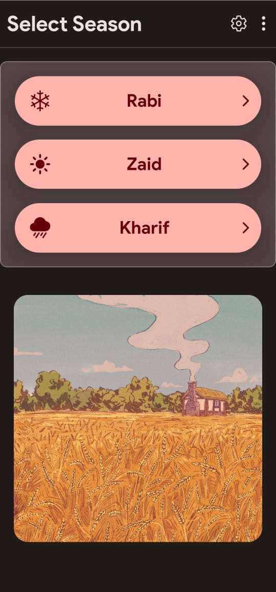

# Indian Crops

### This is a Android App which shows several planting seasons and prominent crops planted in that season

## Build Steps

###1. clone this repo

1. `git clone <link/to/this/repo>`
2. go to project directory do npm install
3. then do npm expo start
4. and use the expo go app from the play store to run.

## To Make apk

[Use EAS](https://docs.expo.dev/build/setup/) to build apk

if you want to build apk locally its a little tricky , you should check expo website for directions.
